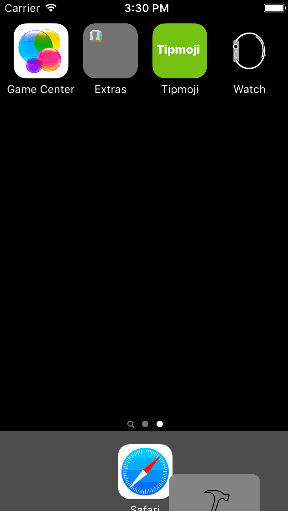

# Pre-work - *Tipmoji*

**Tipmoji** is an emoji tip calculator application for iOS.

Submitted by: **Kristen Turner**

Time spent: **9.5** hours spent in total

## User Stories

The following **required** functionality is complete:
* [X] User can enter a bill amount, choose a tip percentage, and see the tip and total values.

The following **optional** features are implemented:
* [ ] Custom font
* [ ] UI animations
* [X] Making sure the keyboard is always visible and the bill amount is always the first responder. This way the user doesn't have to tap anywhere to use this app. Just launch the app and start typing.

The following **additional** features are implemented:

- [X] Emojis in UI Labels
- [X] ImageView to indicate "active" emoji
- [X] Customized Navigation Bar
- [X] Custom color for placeholder text
- [X] Image assets for dividing lines
- [X] App icon

## Video Walkthrough 

Here's a walkthrough of implemented user stories:

GIF created with [LiceCap](http://www.cockos.com/licecap/).

## Notes

Describe any challenges encountered while building the app.

Thread1 Signal SIGABRT error from changing name of Label.

Thought I broke keyboard, but just had to disconnect hardware keyboard, then reconnect, then toggle.

Lots of SIGABRT errors when trying to keep keyboard always present.

Need an indication of which emoji is "active". (None of the emojis are actually active as they are just text in Labels on top of the segmented control.) Spent over an hour on this, but could not figure it out. I'm posting my demo gif on fbook to see if any of my friends will help me. Will update if so.

Update 9/21/2016: A friend helped me with problem above.

## License

    Copyright [2016] [Kristen Turner]

    Licensed under the Apache License, Version 2.0 (the "License");
    you may not use this file except in compliance with the License.
    You may obtain a copy of the License at

        http://www.apache.org/licenses/LICENSE-2.0

    Unless required by applicable law or agreed to in writing, software
    distributed under the License is distributed on an "AS IS" BASIS,
    WITHOUT WARRANTIES OR CONDITIONS OF ANY KIND, either express or implied.
    See the License for the specific language governing permissions and
    limitations under the License.

